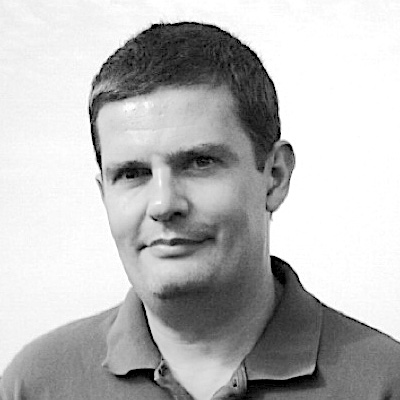
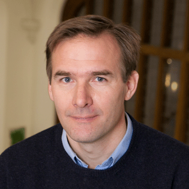
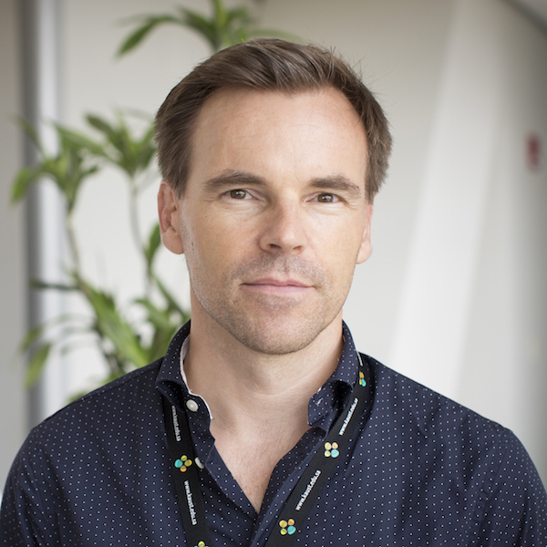
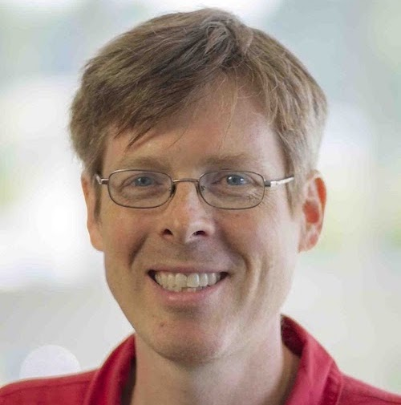
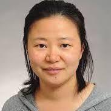

# Mission

| The SPECFEM project is dedicated to Dimitri Komatitsch and open-source development. Our goal is to advance Earth sciences by providing computational tools to the community. | {:height="auto" width="100px" class="circle middle"} |

## Team

A major involvement in the development and maintenance of the SPECFEM project is done by: 

| [{:height="auto" width="100px" class="circle middle"}](https://geosciences.princeton.edu/people/jeroen-tromp) | **Jeroen Tromp**, *Princeton University* Founder of *SPECFEM* codes (together with Dimitri Komatitsch) |
| [{:height="auto" width="100px" class="circle middle"}](https://danielpeter.github.io) | **Daniel Peter**, *KAUST* Lead developer and maintainer of *SPECFEM* codes |
| [{:height="auto" width="100px" class="circle middle"}](https://sites.google.com/alaska.edu/carltape) | **Carl Tape**, *University of Alaska Fairbanks* User training and developer meeting organizer |
| [{:height="auto" width="100px" class="circle middle"}](https://www.physics.utoronto.ca/members/liu-qinya/) | **Qinya Liu**, *University of Toronto* Adjoint code capabilities, developer meeting organizer |
| [{:height="auto" width="100px" class="circle middle"}](https://www.researchgate.net/profile/Emanuele-Casarotti) | **Emanuele Casarotti**, *INGV* Meshing expert |
| [{:height="auto" width="100px" class="circle middle"}](https://researchcomputing.princeton.edu/about/people-directory/rohit-kakodkar) | **Rohit Kakodkar**, *Princeton University* Software engineer for future code development |
| [{:height="auto" width="100px" class="circle middle"}](https://bch0w.github.io) | **Bryant Chow**, *University of Alaska Fairbanks* Lead developer of adjTomo tools |

 
Contributions to these open-source codes come from many authors. Please find the authors list in the corresponding code repositories.

# Milestones

A short timeline of major SPECFEM achievements: 

2015

<h3>K computer simulation > 1.24 PFlops</h3> (shortest period ~ 1.2 s) 
on 82,134 nodes, 82,134 MPI ranks w/ 8 OpenMP threads, 657,072 cores

 <!-- entry -->

2013

<h3>Blue Waters XE6 simulation > 1 PFlops</h3> (shortest period < 2 s)  
on 21,675 XE nodes, 693,600 MPI ranks, 693,600 cores

 <!-- entry -->

2010

<h3>BULL Joseph Fourier Prize winner</h3>  
for the partial GPU port of <it>SPECFEM3D_GLOBE</it>

 <!-- entry -->

2008

<h3>ACM Gordon Bell Finalist</h3>  
for <it>SPECFEM3D_GLOBE</it> simulation reaching resolution of 1.72s shortest period

 <!-- entry -->

2008

<h3>Kraken XT5 simulation > 160 TFlops</h3> (shortest period ~1.72 s)  
on 149,784 cores

 <!-- entry -->

2003

<h3>ACM Gordon Bell Award</h3>  
for Best Performance of <it>SPECFEM3D_GLOBE</it> simulation on the Earth Simulator

 <!-- entry -->

2003

<h3>Earth Simulator simulation > 5 TFlops</h3> (shortest period ~5 s)  
on 243 nodes, 1,944 MPI ranks, 1,944 cores

 <!-- entry -->

 <!-- entries -->

 <!-- timeline -->

 
