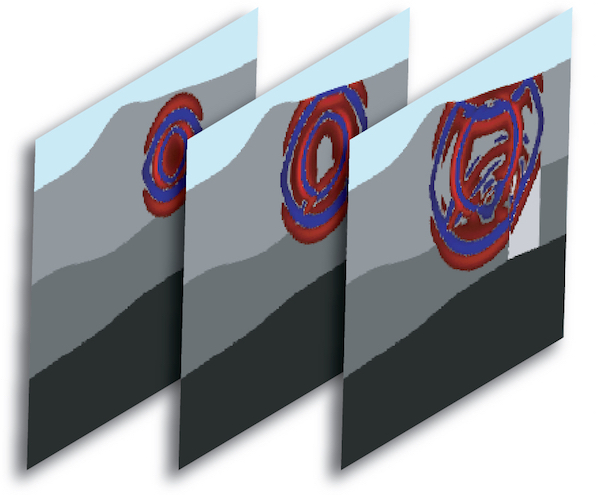
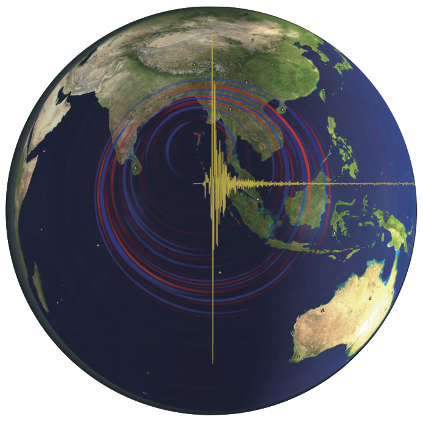

# SPECFEM

The SPECFEM codes use the spectral-element method to simulate seismic wave propagation on different scales. Together with dedicated inversion tools, they constitute an ecosystem in computational seismology to address diverse topics related to seismic tomography and ground-shaking hazard analysis.

|  Solvers |     |     |
| ---      | --- | --- |
| [{:height="auto" width="400px"}](https://github.com/geodynamics/specfem2d) | [SPECFEM2D](https://github.com/geodynamics/specfem2d) |  SPECFEM2D simulates forward and adjoint seismic wave propagation in two-dimensional acoustic, (an)elastic, poroelastic or coupled acoustic-(an)elastic-poroelastic media, with Convolution PML absorbing conditions. |
| [{:height="auto" width="400px"}](https://github.com/geodynamics/specfem3d) | [SPECFEM3D_Cartesian](https://github.com/geodynamics/specfem3d) | SPECFEM3D_Cartesian simulates acoustic (fluid), elastic (solid), coupled acoustic/elastic, poroelastic or seismic wave propagation in any type of conforming mesh of hexahedra (structured or not). |
| [{:height="auto" width="400px"}](https://github.com/geodynamics/specfem3d_globe) | [SPECFEM3D_GLOBE](https://github.com/geodynamics/specfem3d_globe) | SPECFEM3D_GLOBE simulates global and regional (continental-scale) seismic wave propagation. |

 
 
These solvers can be used with various inversion tools to perform seismic adjoint tomography:
 
 

| Inversion tools |     |     |
| ---             | --- | --- |
| [{:height="auto" width="200px"}](https://github.com/adjtomo) |  [adjTomo](https://github.com/adjtomo) | Landing page for automated seismic waveform inversion tools |
