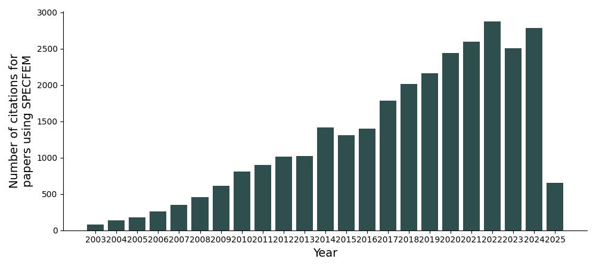

# Publications:
The open-source development of the SPECFEM codes has allowed researchers across the globe to apply them in various fields of study. Below shows the citation count of journal articles that utilised the SPECFEM codes. Seminal papers relating to the development of, and theory behind, SPECFEM can be found on the [Training page](training.md).  

## Recent publications using SPECFEM:
#### Here we list some recent publications using some of the SPECFEM codes. A larger, albeit possibly non-exhaustive, list of publications can be found on our [ Google Scholar](https://scholar.google.com/citations?hl=en&user=bvjzHdUAAAAJ&view_op=list_works&sortby=pubdate).

<i><b>Seismic wavefield injection based on interface discontinuity: Theory and numerical implementation based upon the spectral-element method</b></i>  
Tianshi Liu, Nanqiao Du, Ting Lei, Kai Wang, Bin He, Ping Tong, Giovanni Grasselli, Qinya Liu   
[ Published in February 2025](https://scholar.google.com/citations?view_op=view_citation&hl=en&oe=ASCII&user=bvjzHdUAAAAJ&sortby=pubdate&citation_for_view=bvjzHdUAAAAJ:gsN89kCJA0AC){:style="color: gray;" target="_blank"}

<i><b>Extraction of Tsunami Signals from Coupled Seismic and Tsunami Waves</b></i>  
Linjian Song, Chao An   
[ Published in February 2025](https://scholar.google.com/citations?view_op=view_citation&hl=en&oe=ASCII&user=bvjzHdUAAAAJ&sortby=pubdate&citation_for_view=bvjzHdUAAAAJ:foquWX3nUaYC){:style="color: gray;" target="_blank"}

<i><b>Efficient hybrid numerical modeling of the seismic wavefield in the presence of solid-fluid boundaries</b></i>  
Chao Lyu, Barbara Romanowicz, Liang Zhao, Yder Masson   
[ Published in February 2025](https://scholar.google.com/citations?view_op=view_citation&hl=en&oe=ASCII&user=bvjzHdUAAAAJ&sortby=pubdate&citation_for_view=bvjzHdUAAAAJ:SpbeaW3--B0C){:style="color: gray;" target="_blank"}

<i><b>Frequency Dependence of Rayleigh Wave Amplification by Variation in Earth Structure Investigated Using the Constant Energy Flux Approximation</b></i>  
William Menke, Colleen A Dalton, Andrew Lloyd, Danielle Lopes da Silva, Vadim Levin   
[ Published in February 2025](https://scholar.google.com/citations?view_op=view_citation&hl=en&oe=ASCII&user=bvjzHdUAAAAJ&sortby=pubdate&citation_for_view=bvjzHdUAAAAJ:hCrLmN-GePgC){:style="color: gray;" target="_blank"}

<i><b>Kinematic rupture modeling of broadband ground motion from the 2022 <i>M</i>S6.9 Menyuan earthquake</b></i>  
Mengtao Wu, Jun Yang   
[ Published in December 2024](https://scholar.google.com/citations?view_op=view_citation&hl=en&oe=ASCII&user=bvjzHdUAAAAJ&sortby=pubdate&citation_for_view=bvjzHdUAAAAJ:8d8msizDQcsC){:style="color: gray;" target="_blank"}

<i><b>Simulations of Ground Motions for Mw 7.9 Nepal Earthquake</b></i>  
M NagaTejasri, STG Raghukanth, Himanshu Mittal   
[ Published in December 2024](https://scholar.google.com/citations?view_op=view_citation&hl=en&oe=ASCII&user=bvjzHdUAAAAJ&sortby=pubdate&citation_for_view=bvjzHdUAAAAJ:xtoqd-5pKcoC){:style="color: gray;" target="_blank"}

<i><b>Nonlinear Seismic Response of an Alluvial Basin Modelled by Spectral Element Method: Implementation of a Davidenkov Constitutive Model</b></i>  
Zhenning Ba, Jingxuan Zhao, Qiaozhi Sang, Jianwen Liang   
[ Published in December 2024](https://scholar.google.com/citations?view_op=view_citation&hl=en&oe=ASCII&user=bvjzHdUAAAAJ&sortby=pubdate&citation_for_view=bvjzHdUAAAAJ:HbR8gkJAVGIC){:style="color: gray;" target="_blank"}

<i><b>Topographic amplification of seismic ground motion at the broad rift zone of SW Ethiopia</b></i>  
Anteneh Legesse, Tilahun Mammo   
[ Published in December 2024](https://scholar.google.com/citations?view_op=view_citation&hl=en&oe=ASCII&user=bvjzHdUAAAAJ&sortby=pubdate&citation_for_view=bvjzHdUAAAAJ:_FM0Bhl9EiAC){:style="color: gray;" target="_blank"}

<i><b>The impact of ambient noise sources in subsurface models estimated from noise correlation waveforms</b></i>  
Eduardo Valero Cano, Andreas Fichtner, Daniel Peter, P Martin Mai   
[ Published in October 2024](https://scholar.google.com/citations?view_op=view_citation&hl=en&oe=ASCII&user=bvjzHdUAAAAJ&sortby=pubdate&citation_for_view=bvjzHdUAAAAJ:Ri6SYOTghG4C){:style="color: gray;" target="_blank"}

<i><b>Cube2sph: A toolkit enabling flexible and accurate continental-scale seismic wave simulations using the SPECFEM3D_Cartesian package</b></i>  
Tianshi Liu, Kai Wang, Yujiang Xie, Bin He, Ting Lei, Nanqiao Du, Ping Tong, Yingjie Yang, Catherine A Rychert, Nicholas Harmon, Giovanni Grasselli, Qinya Liu   
[ Published in August 2024](https://scholar.google.com/citations?view_op=view_citation&hl=en&oe=ASCII&user=bvjzHdUAAAAJ&sortby=pubdate&citation_for_view=bvjzHdUAAAAJ:kz9GbA2Ns4gC){:style="color: gray;" target="_blank"}

<i><b>Physics-based assessment of earthquake potential on the Anninghe-Zemuhe fault system in southwestern China</b></i>  
Faqi Diao, Huihui Weng, Jean-Paul Ampuero, Zhigang Shao, Rongjiang Wang, Feng Long, Xiong Xiong   
[ Published in August 2024](https://scholar.google.com/citations?view_op=view_citation&hl=en&oe=ASCII&user=bvjzHdUAAAAJ&sortby=pubdate&citation_for_view=bvjzHdUAAAAJ:PVjk1bu6vJQC){:style="color: gray;" target="_blank"}

<i><b>A 3D computational model for ground motion simulation in Peninsular India</b></i>  
KP Sreejaya, STG Raghukanth   
[ Published in August 2024](https://scholar.google.com/citations?view_op=view_citation&hl=en&oe=ASCII&user=bvjzHdUAAAAJ&sortby=pubdate&citation_for_view=bvjzHdUAAAAJ:GtLg2Ama23sC){:style="color: gray;" target="_blank"}

<i><b>Multi&#8208;scale seismic imaging of the Ridgecrest, CA, region with waveform inversion of regional and dense array data</b></i>  
Guoliang Li, Yehuda Ben&#8208;Zion   
[ Published in July 2024](https://scholar.google.com/citations?view_op=view_citation&hl=en&oe=ASCII&user=bvjzHdUAAAAJ&sortby=pubdate&citation_for_view=bvjzHdUAAAAJ:bz8QjSJIRt4C){:style="color: gray;" target="_blank"}

<i><b>Analyzing SpecFEM-3D&#39;s Performance on ARM A64FX Architecture with Compiler Variations</b></i>  
Om Jadhav, Sabbi Vamshi Krishna, Prashant Dinde, Sanjay Wandhekar, Dharm Singh Jat   
[ Published in July 2024](https://scholar.google.com/citations?view_op=view_citation&hl=en&oe=ASCII&user=bvjzHdUAAAAJ&sortby=pubdate&citation_for_view=bvjzHdUAAAAJ:M7yex6snE4oC){:style="color: gray;" target="_blank"}

<i><b>Numerical modelling of impact seismic sources using the stress glut theory</b></i>  
Marouchka Froment, Philippe Lognonné, Carene Larmat, Zhou Lei, Esteban Rougier, Taichi Kawamura   
[ Published in July 2024](https://scholar.google.com/citations?view_op=view_citation&hl=en&oe=ASCII&user=bvjzHdUAAAAJ&sortby=pubdate&citation_for_view=bvjzHdUAAAAJ:Dip1O2bNi0gC){:style="color: gray;" target="_blank"}

<i><b>Investigating seismic performance of SMRF buildings under subshear and supershear rupture conditions: Assessment of storey-level internal damage</b></i>  
Sumit Saha, KSK Karthik Reddy, Krishn Katyal, Surendra Nadh Somala   
[ Published in June 2024](https://scholar.google.com/citations?view_op=view_citation&hl=en&oe=ASCII&user=bvjzHdUAAAAJ&sortby=pubdate&citation_for_view=bvjzHdUAAAAJ:LO7wyVUgiFcC){:style="color: gray;" target="_blank"}

<i><b>Imaging Upper&#8208;Mantle Anisotropy with Transdimensional Bayesian Monte Carlo Sampling</b></i>  
Gianmarco Del Piccolo, Brandon P VanderBeek, Manuele Faccenda, Andrea Morelli, Joseph S Byrnes   
[ Published in June 2024](https://scholar.google.com/citations?view_op=view_citation&hl=en&oe=ASCII&user=bvjzHdUAAAAJ&sortby=pubdate&citation_for_view=bvjzHdUAAAAJ:tuHXwOkdijsC){:style="color: gray;" target="_blank"}

<i><b>Forward modeling of quake&#8217;s infrasound recorded in the stratosphere on board balloon platforms</b></i>  
S Gerier, RF Garcia, Roland Martin, A Hertzog   
[ Published in June 2024](https://scholar.google.com/citations?view_op=view_citation&hl=en&oe=ASCII&user=bvjzHdUAAAAJ&sortby=pubdate&citation_for_view=bvjzHdUAAAAJ:q3CdL3IzO_QC){:style="color: gray;" target="_blank"}

<i><b>2D Analytical Modelling for Ultrasonic Inspection of Concrete Structures: Effects of Scatterers Position Correlation</b></i>  
N Khalid, M Darmon, J-F Chaix   
[ Published in May 2024](https://scholar.google.com/citations?view_op=view_citation&hl=en&oe=ASCII&user=bvjzHdUAAAAJ&sortby=pubdate&citation_for_view=bvjzHdUAAAAJ:FAceZFleit8C){:style="color: gray;" target="_blank"}

<i><b>Imaging upper mantle anisotropy with traveltime and splitting intensity observations from teleseismic shear waves: insights from tomographic reconstructions of subduction &#8230;</b></i>  
Brandon P VanderBeek, Rosalia Lo Bue, Francesco Rappisi, Manuele Faccenda   
[ Published in December 2023](https://scholar.google.com/citations?view_op=view_citation&hl=en&oe=ASCII&user=bvjzHdUAAAAJ&sortby=pubdate&citation_for_view=bvjzHdUAAAAJ:MLfJN-KU85MC){:style="color: gray;" target="_blank"}

