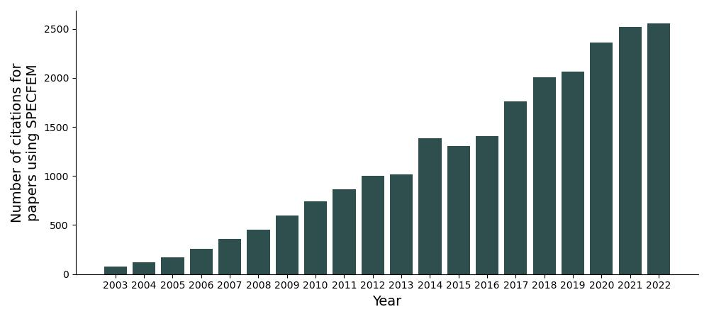

# Publications:
The open-source development of the SPECFEM codes has allowed researchers across the globe to apply them in various fields of study. Below shows the citation count of journal articles that utilised the SPECFEM codes. Seminal papers relating to the development of, and theory behind, SPECFEM can be found on the [Training page](training.md).  

## Recent publications using SPECFEM:
#### Here we list some recent publications using some of the SPECFEM codes. A larger, albeit possibly non-exhaustive, list of publications can be found on our [Google Scholar](https://scholar.google.com/citations?hl=en&user=bvjzHdUAAAAJ&view_op=list_works&sortby=pubdate){:class="fontawesome-external-link"}.

<i><b>Inferring the characteristics of marine sediments from the acoustic response of a known, partially buried object</b></i>  
Alexis Bottero, Simone Sternini, Jit Sarkar, WA Kuperman   
[Published in July 2022](https://scholar.google.com/citations?view_op=view_citation&hl=en&oe=ASCII&user=bvjzHdUAAAAJ&sortby=pubdate&citation_for_view=bvjzHdUAAAAJ:VL0QpB8kHFEC){:class="fontawesome-external-link" style="color: gray;" target="_blank"}

<i><b>A method to generate initial fault stresses for physics-based ground motion prediction consistent with regional seismicity</b></i>  
Elif Oral, Jean Paul Ampuero, Javier Ruiz, Domniki Asimaki   
[Published in April 2022](https://scholar.google.com/citations?view_op=view_citation&hl=en&oe=ASCII&user=bvjzHdUAAAAJ&sortby=pubdate&citation_for_view=bvjzHdUAAAAJ:Mojj43d5GZwC){:class="fontawesome-external-link" style="color: gray;" target="_blank"}

<i><b>Centroid Moment Tensor Catalog With 3D Lithospheric Wave Speed Model: The 2016&#8211;2017 Central Apennines Sequence</b></i>  
Pietro Artale Harris, Laura Scognamiglio, Federica Magnoni, Emanuele Casarotti, Elisa Tinti   
[Published in April 2022](https://scholar.google.com/citations?view_op=view_citation&hl=en&oe=ASCII&user=bvjzHdUAAAAJ&sortby=pubdate&citation_for_view=bvjzHdUAAAAJ:VOx2b1Wkg3QC){:class="fontawesome-external-link" style="color: gray;" target="_blank"}

<i><b>Adjoint tomography of the Italian lithosphere</b></i>  
Federica Magnoni, Emanuele Casarotti, Dimitri Komatitsch, Raffaele Di Stefano, Maria Grazia Ciaccio, Carl Tape, Daniele Melini, Alberto Michelini, Antonio Piersanti, Jeroen Tromp   
[Published in March 2022](https://scholar.google.com/citations?view_op=view_citation&hl=en&oe=ASCII&user=bvjzHdUAAAAJ&sortby=pubdate&citation_for_view=bvjzHdUAAAAJ:dfsIfKJdRG4C){:class="fontawesome-external-link" style="color: gray;" target="_blank"}

<i><b>Cartesian Meshing Spherical Earth (CMSE): A Code Package to Incorporate the Spherical Earth in SPECFEM3D Cartesian Simulations</b></i>  
Guoliang Li, Kai Tao, Min Chen, Jiaqi Li, Ross Maguire, Xiaodan Ma   
[Published in March 2022](https://scholar.google.com/citations?view_op=view_citation&hl=en&oe=ASCII&user=bvjzHdUAAAAJ&sortby=pubdate&citation_for_view=bvjzHdUAAAAJ:TFP_iSt0sucC){:class="fontawesome-external-link" style="color: gray;" target="_blank"}

<i><b>Acoustic digital twin for passive structural health monitoring</b></i>  
Simone Sternini, Alexis Bottero, WA Kuperman   
[Published in February 2022](https://scholar.google.com/citations?view_op=view_citation&hl=en&oe=ASCII&user=bvjzHdUAAAAJ&sortby=pubdate&citation_for_view=bvjzHdUAAAAJ:ye4kPcJQO24C){:class="fontawesome-external-link" style="color: gray;" target="_blank"}

<i><b>Spectral element modeling of acoustic to seismic coupling over topography</b></i>  
Jordan W Bishop, David Fee, Ryan Modrak, Carl Tape, Keehoon Kim   
[Published in January 2022](https://scholar.google.com/citations?view_op=view_citation&hl=en&oe=ASCII&user=bvjzHdUAAAAJ&sortby=pubdate&citation_for_view=bvjzHdUAAAAJ:yD5IFk8b50cC){:class="fontawesome-external-link" style="color: gray;" target="_blank"}

<i><b>Strong Upper&#8208;Plate Heterogeneity at the Hikurangi Subduction Margin (North Island, New Zealand) Imaged by Adjoint Tomography</b></i>  
Bryant Chow, Yoshihiro Kaneko, Carl Tape, Ryan Modrak, Nick Mortimer, Stephen Bannister, John Townend   
[Published in January 2022](https://scholar.google.com/citations?view_op=view_citation&hl=en&oe=ASCII&user=bvjzHdUAAAAJ&sortby=pubdate&citation_for_view=bvjzHdUAAAAJ:zA6iFVUQeVQC){:class="fontawesome-external-link" style="color: gray;" target="_blank"}

<i><b>The effect of rupture directivity, distance and skew angle on the collapse fragilities of bridges</b></i>  
Surendra Nadh Somala, KSK Karthik Reddy, Sujith Mangalathu   
[Published in November 2021](https://scholar.google.com/citations?view_op=view_citation&hl=en&oe=ASCII&user=bvjzHdUAAAAJ&sortby=pubdate&citation_for_view=bvjzHdUAAAAJ:u5HHmVD_uO8C){:class="fontawesome-external-link" style="color: gray;" target="_blank"}

<i><b>The Influence of Depth&#8208;Varying Elastic Properties of the Upper Plate on Megathrust Earthquake Rupture Dynamics and Tsunamigenesis</b></i>  
Manel Prada, Percy Galvez, Jean&#8208;Paul Ampuero, Valentí Sallarès, Carlos Sánchez&#8208;Linares, Jorge Macías, Daniel Peter   
[Published in November 2021](https://scholar.google.com/citations?view_op=view_citation&hl=en&oe=ASCII&user=bvjzHdUAAAAJ&sortby=pubdate&citation_for_view=bvjzHdUAAAAJ:eflP2zaiRacC){:class="fontawesome-external-link" style="color: gray;" target="_blank"}

<i><b>Dynamic Rupture Study of Near&#8208;Field Velocity Pulses during the 2016 Kumamoto Earthquake, Japan</b></i>  
Kenichi Tsuda   
[Published in October 2021](https://scholar.google.com/citations?view_op=view_citation&hl=en&oe=ASCII&user=bvjzHdUAAAAJ&sortby=pubdate&citation_for_view=bvjzHdUAAAAJ:WA5NYHcadZ8C){:class="fontawesome-external-link" style="color: gray;" target="_blank"}

<i><b>Multicycle Simulation of Strike&#8208;Slip Earthquake Rupture for Use in Near&#8208;Source Ground&#8208;Motion Simulations</b></i>  
Percy Galvez, Anatoly Petukhin, Paul Somerville, Jean&#8208;Paul Ampuero, Ken Miyakoshi, Daniel Peter, Kojiro Irikura   
[Published in October 2021](https://scholar.google.com/citations?view_op=view_citation&hl=en&oe=ASCII&user=bvjzHdUAAAAJ&sortby=pubdate&citation_for_view=bvjzHdUAAAAJ:BrmTIyaxlBUC){:class="fontawesome-external-link" style="color: gray;" target="_blank"}

<i><b>Generation of secondary microseism Love waves: effects of bathymetry, 3-D structure and source seasonality</b></i>  
Lucia Gualtieri, Etienne Bachmann, Frederik J Simons, Jeroen Tromp   
[Published in July 2021](https://scholar.google.com/citations?view_op=view_citation&hl=en&oe=ASCII&user=bvjzHdUAAAAJ&sortby=pubdate&citation_for_view=bvjzHdUAAAAJ:u_35RYKgDlwC){:class="fontawesome-external-link" style="color: gray;" target="_blank"}

<i><b>Imaging upper mantle anisotropy with teleseismic <i>P</i>-wave delays: insights from tomographic reconstructions of subduction simulations</b></i>  
Brandon P VanderBeek, Manuele Faccenda   
[Published in June 2021](https://scholar.google.com/citations?view_op=view_citation&hl=en&oe=ASCII&user=bvjzHdUAAAAJ&sortby=pubdate&citation_for_view=bvjzHdUAAAAJ:eJXPG6dFmWUC){:class="fontawesome-external-link" style="color: gray;" target="_blank"}

<i><b>Continuum of earthquake rupture speeds enabled by oblique slip</b></i>  
Huihui Weng, Jean-Paul Ampuero   
[Published in December 2020](https://scholar.google.com/citations?view_op=view_citation&hl=en&oe=ASCII&user=bvjzHdUAAAAJ&sortby=pubdate&citation_for_view=bvjzHdUAAAAJ:olpn-zPbct0C){:class="fontawesome-external-link" style="color: gray;" target="_blank"}

<i><b>An automated workflow for adjoint tomography&#8212;waveform misfits and synthetic inversions for the North Island, New Zealand</b></i>  
Bryant Chow, Yoshihiro Kaneko, Carl Tape, Ryan Modrak, John Townend   
[Published in December 2020](https://scholar.google.com/citations?view_op=view_citation&hl=en&oe=ASCII&user=bvjzHdUAAAAJ&sortby=pubdate&citation_for_view=bvjzHdUAAAAJ:rO6llkc54NcC){:class="fontawesome-external-link" style="color: gray;" target="_blank"}

<i><b>On the influence of slopes, source, seabed and water column properties on T waves: Generation at shore</b></i>  
Alexis Bottero, Paul Cristini, Dimitri Komatitsch   
[Published in December 2020](https://scholar.google.com/citations?view_op=view_citation&hl=en&oe=ASCII&user=bvjzHdUAAAAJ&sortby=pubdate&citation_for_view=bvjzHdUAAAAJ:5Ul4iDaHHb8C){:class="fontawesome-external-link" style="color: gray;" target="_blank"}

<i><b>The origin of secondary microseism Love waves</b></i>  
Lucia Gualtieri, Etienne Bachmann, Frederik J Simons, Jeroen Tromp   
[Published in November 2020](https://scholar.google.com/citations?view_op=view_citation&hl=en&oe=ASCII&user=bvjzHdUAAAAJ&sortby=pubdate&citation_for_view=bvjzHdUAAAAJ:GnPB-g6toBAC){:class="fontawesome-external-link" style="color: gray;" target="_blank"}

<i><b>Global adjoint tomography&#8212;model GLAD-M25</b></i>  
Wenjie Lei, Youyi Ruan, Ebru Bozda&#287;, Daniel Peter, Matthieu Lefebvre, Dimitri Komatitsch, Jeroen Tromp, Judith Hill, Norbert Podhorszki, David Pugmire   
[Published in October 2020](https://scholar.google.com/citations?view_op=view_citation&hl=en&oe=ASCII&user=bvjzHdUAAAAJ&sortby=pubdate&citation_for_view=bvjzHdUAAAAJ:MXK_kJrjxJIC){:class="fontawesome-external-link" style="color: gray;" target="_blank"}

<i><b>Probing depth and lateral variations of upper-mantle seismic anisotropy from full-waveform inversion of teleseismic body-waves</b></i>  
Stephen Beller, Sébastien Chevrot   
[Published in July 2020](https://scholar.google.com/citations?view_op=view_citation&hl=en&oe=ASCII&user=bvjzHdUAAAAJ&sortby=pubdate&citation_for_view=bvjzHdUAAAAJ:D_sINldO8mEC){:class="fontawesome-external-link" style="color: gray;" target="_blank"}

