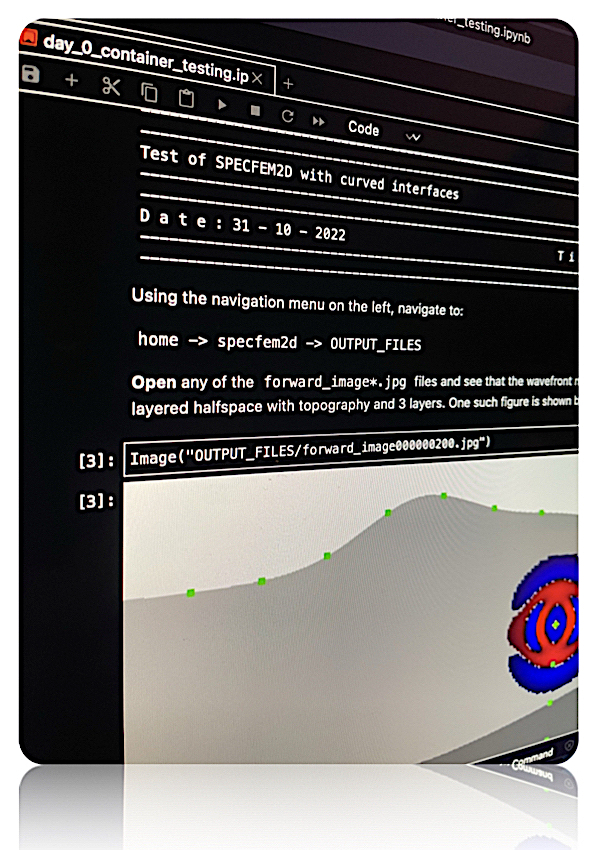

# Training

## Seminal papers

Here is a short list of the main papers related to the development and theory behind the SPECFEM codes.
You can find more detailed feature citations and attributions in the user manuals of each software repository.

- <b>The spectral-element method: an efficient tool to simulate the seismic response of 2D and 3D geological structures</b>, 
*D. Komatitsch and J. P. Vilotte*,
Bull. seism. Soc. Am., 88(2):368–392, 1998 
[doi:10.1785/BSSA0880020368](https://doi.org/10.1785/BSSA0880020368){:style="color: gray;" target="_blank"}

- <b>Introduction to the spectral-element method for 3-D seismic wave propagation</b>, 
*D. Komatitsch and J. Tromp*,
Geophys. J. Int., 139(3):806–822, 1999 
[doi:10.1046/j.1365-246x.1999.00967.x](https://doi.org/10.1046/j.1365-246x.1999.00967.x){:style="color: gray;" target="_blank"}

- <b>Spectral-element simulations of global seismic wave propagation - I. Validation</b>, 
*D. Komatitsch and J. Tromp*,
Geophys. J. Int., 149(2):390–412, 2002 
[doi:10.1046/j.1365-246X.2002.01653.x](https://doi.org/10.1046/j.1365-246X.2002.01653.x){:style="color: gray;" target="_blank"}

- <b>Spectral-element simulations of global seismic wave propagation - II. 3-D models, oceans, rotation, and self-gravitation</b>, 
*D. Komatitsch and J. Tromp*,
Geophys. J. Int., 150(1):303–318, 2002 
[doi:10.1046/j.1365-246X.2002.01716.x](https://doi.org/10.1046/j.1365-246X.2002.01716.x){:style="color: gray;" target="_blank"}

- <b>Seismic tomography, adjoint methods, time reversal and banana-doughnut kernels</b>, 
*J. Tromp, C. Tape, and Q. Liu*,
Geophys. J. Int., 160(1):195–216, 2005 
[doi:10.1111/j.1365-246X.2004.02453.x](https://doi.org/10.1111/j.1365-246X.2004.02453.x){:style="color: gray;" target="_blank"}

- <b>Spectral-element and adjoint methods in seismology</b>, 
*J. Tromp, D. Komatitsch, and Q. Liu*,
Communications in Computational Physics, 3(1):1–32, 2008 
[spectral-element-and-adjoint-methods-in-seismology](https://global-sci.com/article/81199/spectral-element-and-adjoint-methods-in-seismology){:style="color: gray;" target="_blank"}

- <b>Forward and adjoint simulations of seismic wave propagation on fully unstructured hexahedral meshes</b>, 
*D. Peter, D. Komatitsch, Y. Luo, R. Martin, N. Le Goff, E. Casarotti, P. Le Loher, F. Magnoni, Q. Liu, C. Blitz,
T. Nissen-Meyer, P. Basini, and J. Tromp*,
Geophys. J. Int., 186(2):721–739, 2011 
[doi:10.1111/j.1365-246X.2011.05044.x](https://doi.org/10.1111/j.1365-246X.2011.05044.x){:style="color: gray;" target="_blank"}

## Workshop material

You will find updated training material here whenever available:

| [{:height="auto" width="200px"}](https://sites.google.com/alaska.edu/carltape/home/research/specfem2022) | [ 2022 SPECFEM Users workshop](https://sites.google.com/alaska.edu/carltape/home/research/specfem2022) |

